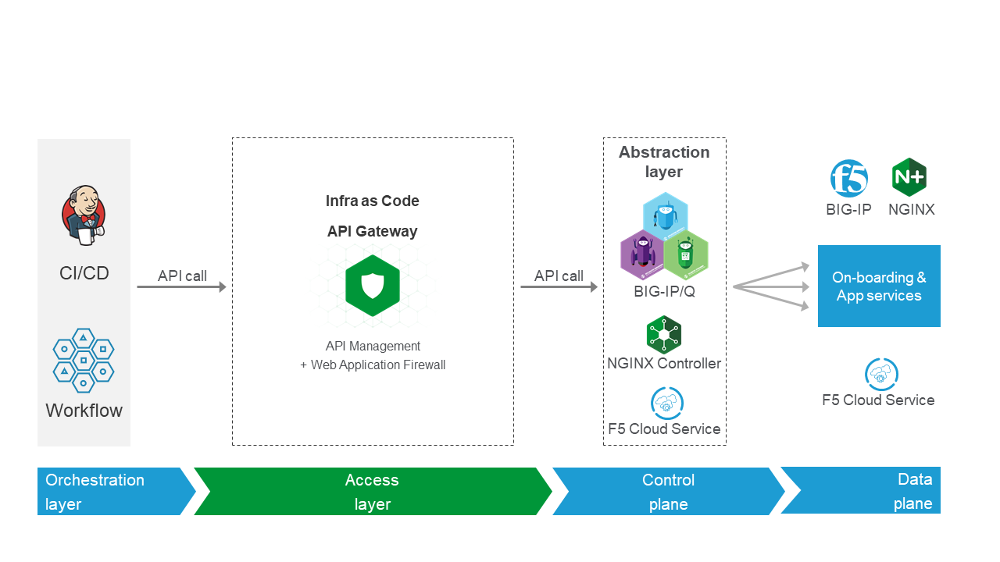
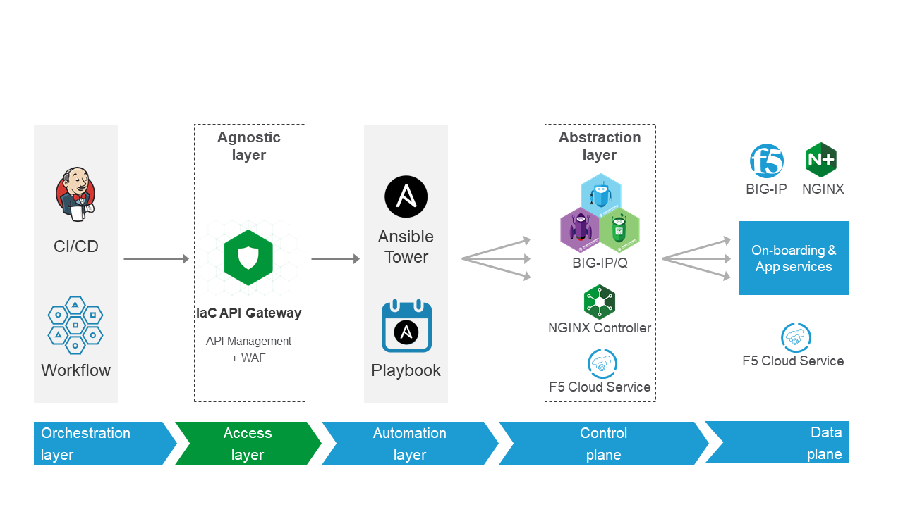
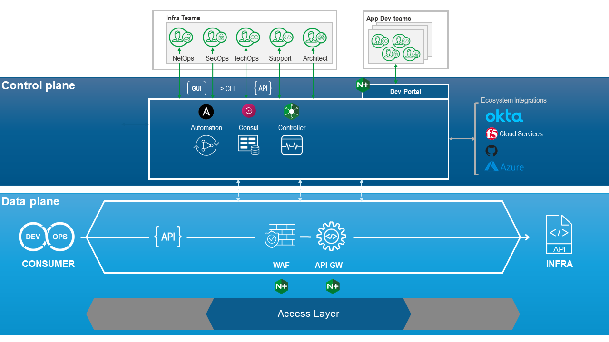
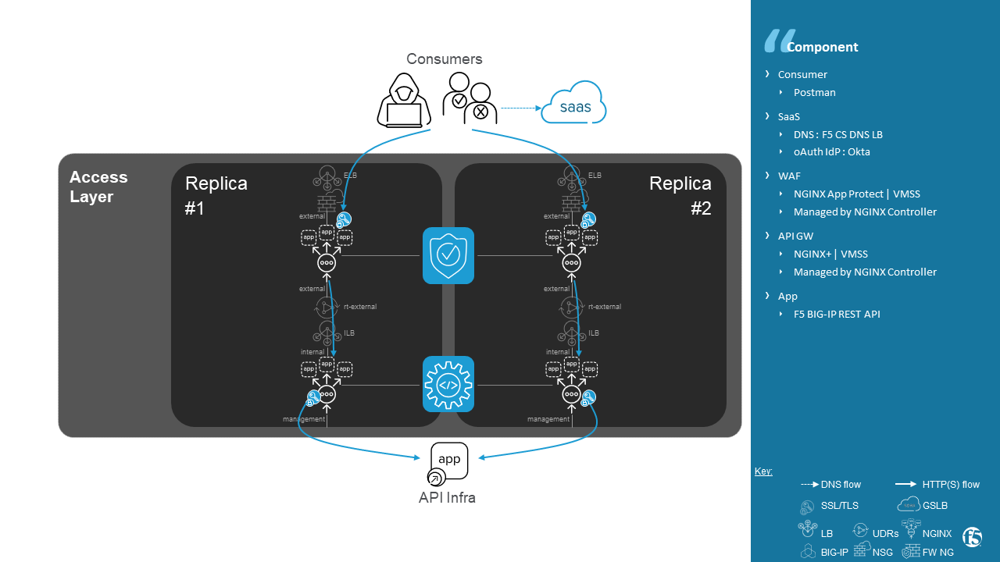
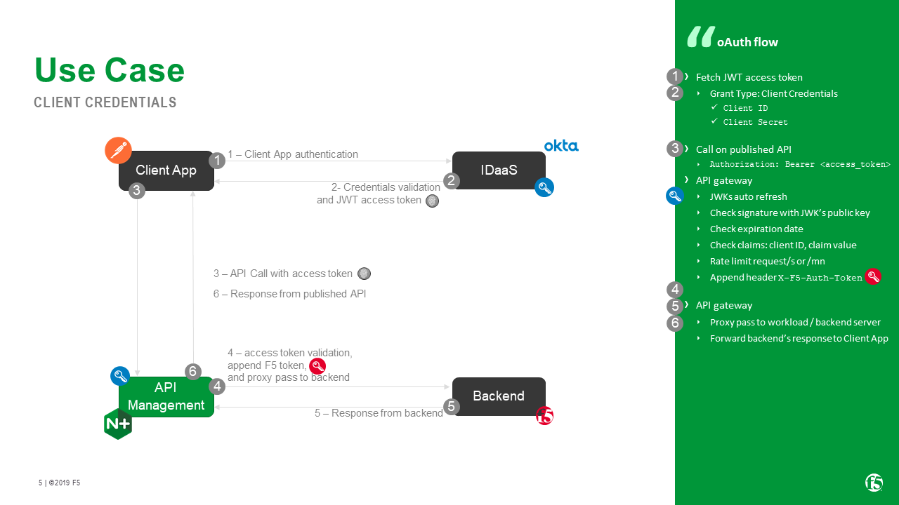
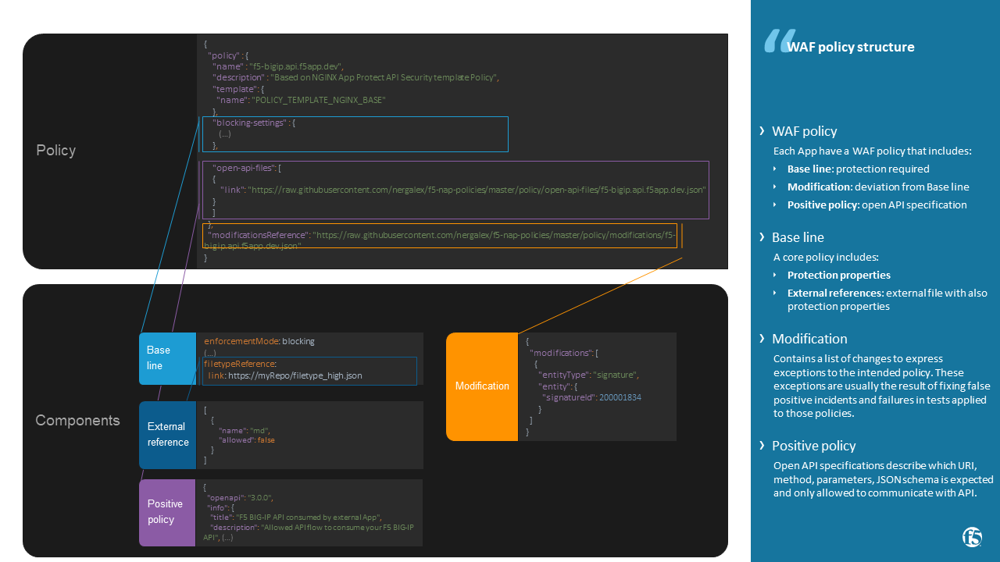
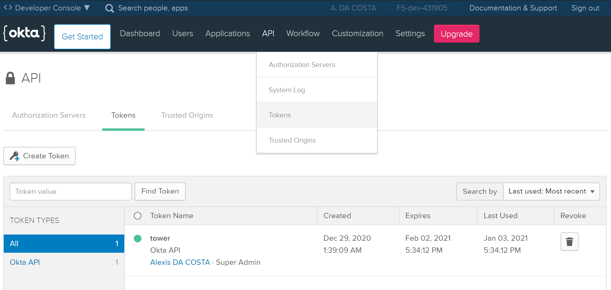
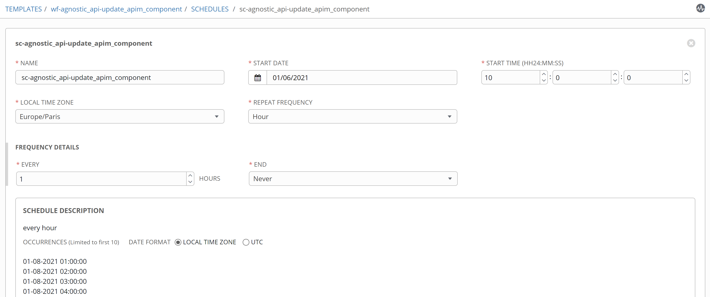

API Management for Infra as Code
=======================================================================
.. contents:: Table of Contents

Introduction
==================================================
Use Case
###############
- **Passwordless** -- Do not share admin right account to API consumer, use temporary token
- **Control and Visibility** -- Manage who can consume (Authentication), which API (Authorization) and track consumption (Accounting)
- **Secured front door** -- Publishing directly infrastructure management API to consumers is also an open door to exploit vulnerability or doing misconfiguration. Because patching infra devices could be a long process, use a WAF natively API oriented to protect control-plane access.
- **Collaboration** -- Publish live documentation to Application Developper (AppDev) on how to consume Infra as Code (IaC)
- **Agility** -- Do not change API when an infrastructure product change, publish agnostic API to your consumer

Benefit
###############
- **Secure Infra as Code** -- Protect and manage published API of your Infra as Code (IaC)
- **Faster App Deployment** -- Accelerate your App deployment by publishing automatically clear and up-to-date API documentation to AppDev
- **Simple management** -- Security Team updates all components of this front door (WAF, API GW and DevPortal) with one file : `openAPI spec file (swagger) <https://swagger.io/specification/>`_

Architecture
###############
Global view
*********************
Infrastructure's management API can be published directly through a secured API GW, as described below:

Some Infra as Code function could be complex to do in one call and this complexity could not be in charge of the consumer.
In this case, complexity is hidden and process by a playbook published through an Automation layer.
This use case permits also to publish an Agnostic API workflow dissociated from infrastructure editors.
Regarding the data path, consumers still make API call to the secured API GW and this one now routes this API request to an automation layer.

Functional view
*********************

Functional components in the data path between consumers and infrastructure devices:

- **DNS** -- DNS name resolution to access to published Application and DevPortal
- **DevPortal** -- Web User Interface that presents to developers how to consume published Applications i.e. published IaC APIs
- **Consumer** -- orchestration tool (`Gitlab <https://docs.gitlab.com/ee/ci/>`_ , `Ansible Tower <https://www.ansible.com/products/tower>`_ , ...)
- **IdP / oAuth Authorization server** -- oAuth Identity Provider to manage access policy to allow Users (consumer) to consume Application (published IaC API)
- **WAF** -- Web Application Firewall to prevent from attack on Application and send metrics/security events to its Controller. Protection features are:
- **+-- Reduce attack surface**: Publish the strict necessary of API apps using up to date `openAPI spec file (swagger) <https://swagger.io/specification/>`_
- **+-- Virtual Patching**: block exploitation of vulnerabilities (`CVE <https://cve.mitre.org/>`_) on underlying App's technologies
- **+-- Weakness in code**: Following awareness of OWASP foundation for `API app <https://owasp.org/www-project-api-security/>`_, raise protection to `prevent from hacking actions <http://veriscommunity.net/enums.html#section-actions>`_
- **API GW** -- oAuth Resource Server, rate limit, monitor service, route based on URI and send metrics/security events to its Controller.
- **infrastructure | Virtual Appliance** -- final devices that receive API requests from consumer
- **infrastructure | Network** -- underlying network and L3/L4 FW

Functional out-of-band components used to manage the solution:

- **Controller** -- Through API or UI, manage configuration, collect metrics/security events and give visibility on managed instances: WAF, API GW, DevPortal
- **Repository** -- External Source of Truth i.e. store configuration files : WAF policy, openAPI spec file of published Applications
- **Key/value store** -- In spite of querying regularly components to retrieve information by playbooks, useful information are stored in a Key/value store
- **Automation tool** -- Deploy configuration on Controller

Product
*********************
Products used for this demo:

- **DNS** -- `F5 Cloud Services <https://simulator.f5.com/>`_
- **DevPortal** -- unlimited instances managed by `NGINX Controller <https://docs.nginx.com/nginx-controller/services/api-management/manage-dev-portals/>`_
- **Consumer** -- `Postman <https://www.postman.com/>`_
- **IdP** -- `Okta <https://www.okta.com/developer/signup>`_
- **WAF**: unlimited instances managed by `NGINX Controller + add-on Application Security module <https://www.nginx.com/blog/introducing-nginx-controller-app-security-for-delivery>`_
- **API GW**: unlimited instances managed by `NGINX Controller + add-on API Management module <https://www.nginx.com/resources/datasheets/nginx-controller-api-management/>`_
- **Repository**: GitHub
- **Controller** -- `NGINX Controller <https://www.nginx.com/products/nginx-controller/>`_
- **Key/value store**: `Consul <https://www.consul.io/>`_
- **Automation tool**: `Ansible Tower <https://www.ansible.com/products/tower>`_
- **infrastructure | Virtual Appliance** -- `F5 BIG-IP <https://clouddocs.f5.com/>`_
- **infrastructure | Network** -- `Azure <https://github.com/ansible-collections/azure>`_

Network view
*********************
The diagram below present the data flow through network components.

oAuth view
*********************
Client Credentials Grant is used in this demo because the identity of the user is not known and consumer (client) is in confidence, so client_secret can be stored client side.
Other grant type work as well, only an access token need to be present in Bearer header.

WAF policy structure
*********************
A WAF policy includes:
- ** Base line **: enabled protection. Definition could be stored in an external file.
- ** API definition **: strict positive policy generated from an external openAPI spec file (swagger). Only compliant request URI, method, JSON key/value specified is allowed.
- ** Modification **: deviation from the Base line. Contains a list of changes to express exceptions to the intended Base line policy. These exceptions are usually the result of fixing false positive incidents and failures in tests applied to those policies.

More details `here <https://docs.nginx.com/nginx-app-protect/configuration/#policy-authoring-and-tuning>`_.

Demo
###############
1) Create Identity Provider
*********************

.. raw:: html

    

Pre-requisites
==============
Okta
##############
- Create an dev account `here <https://developer.okta.com/signup/>`_
- Keep the created Okta domain, it will be used later in deployment workflow as an ``extra variable`` named ``organization``
- Create a token for automation tool that will deploy the solution

- Keep the created API key, it will be used later in deployment workflow as an ``extra variable`` named ``api_key``

Ansible Tower
##############
virtualenv
***************************
- Create a virtualenv following `this guide <https://docs.ansible.com/ansible-tower/latest/html/upgrade-migration-guide/virtualenv.html>`_
- In virtualenv, as a prerequisite for Azure collection, install Azure SDK following `this guide <https://github.com/ansible-collections/azure>`_
- In virtualenv, as a prerequisite for K8S collection, install ``openshift`` following `this guide <https://github.com/ansible-collections/community.kubernetes>`_

Credential
***************************
- Create a Service Principal on Azure following `this guide <https://docs.microsoft.com/en-us/azure/active-directory/develop/quickstart-register-app>`_
- Create a Microsoft Azure Resource Manager following `this guide <https://docs.ansible.com/ansible-tower/latest/html/userguide/credentials.html#microsoft-azure-resource-manager>`_
- Create Credentials ``cred_NGINX`` to manage access to NGINX instances following `this guide <https://docs.ansible.com/ansible-tower/latest/html/userguide/credentials.html#machine>`_

=====================================================   =============================================   =============================================   =============================================   =============================================
REDENTIAL TYPE                                          USERNAME                                        SSH PRIVATE KEY                                 SIGNED SSH CERTIFICATE                          PRIVILEGE ESCALATION METHOD
=====================================================   =============================================   =============================================   =============================================   =============================================
``Machine``                                             ``my_VM_admin_user``                            ``my_VM_admin_user_key``                        ``my_VM_admin_user_CRT``                        ``sudo``
=====================================================   =============================================   =============================================   =============================================   =============================================

Ansible role structure
######################
- Deployment is based on ``workflow template``. Example: ``workflow template`` = ``wf-create_create_edge_security_inbound``
- ``workflow template`` includes multiple ``job template``. Example: ``job template`` = ``poc-azure_create_hub_edge_security_inbound``
- ``job template`` have an associated ``playbook``. Example: ``playbook`` = ``playbooks/poc-azure.yaml``
- ``playbook`` launch a ``play`` in a ``role``. Example: ``role`` = ``poc-azure``

.. code:: yaml

    - hosts: localhost
      gather_facts: no
      roles:
        - role: poc-azure

- ``play`` is an ``extra variable`` named ``activity`` and set in each ``job template``. Example: ``create_hub_edge_security_inbound``
- The specified ``play`` (or ``activity``) is launched by the ``main.yaml`` task located in the role ``tasks/main.yaml``

.. code:: yaml

    - name: Run specified activity
      include_tasks: "{{ activity }}.yaml"
      when: activity is defined

- The specified ``play`` contains ``tasks`` to execute. Example: play=``create_hub_edge_security_inbound.yaml``

1) Create Identity Provider
==================================================
Create and launch a workflow template ``wf-okta-create_IdP`` that includes those Job templates in this order:

=============================================================   =============================================       =============================================   =============================================   =============================================   =============================================   =============================================
Job template                                                    objective                                           playbook                                        activity                                        inventory                                       limit                                           credential
=============================================================   =============================================       =============================================   =============================================   =============================================   =============================================   =============================================
``poc-okta-create_group``                                       Create a user group                                 ``playbooks/poc-okta.yaml``                    ``create_group``                                 localhost                                       localhost
``poc-okta-create_user``                                        Create a user                                       ``playbooks/poc-okta.yaml``                    ``create_user``                                  localhost                                       localhost
``poc-okta-create_app``                                         Create an application for each infra product        ``playbooks/poc-okta.yaml``                    ``create_app``                                   localhost                                       localhost
``poc-okta-create_auth_server``                                 Create an authorization server                      ``playbooks/poc-okta.yaml``                    ``create_auth_server``                           localhost                                       localhost
``poc-consul_agnostic_api-register_idp_info``                   Save info in Key/Value store                        ``playbooks/poc-consul.yaml``                  ``register_idp_info``                            localhost                                       localhost
=============================================================   =============================================       =============================================   =============================================   =============================================   =============================================   =============================================

==============================================  =============================================
Extra variable                                  Description
==============================================  =============================================
``extra_okta``                                  dict of Okta properties
``extra_okta.organization``                     domain (see § Pre-requisites)
``extra_okta.api_key``                          API key (see § Pre-requisites)
``extra_okta.group_name``                       user group
``extra_okta.user``                             dict of user properties
``extra_okta.user.name``                        user name
``extra_okta.user.login``                       user login
``extra_okta.user.password``                    user password
``extra_okta.app``                              dict of app properties
``extra_okta.app.name``                         infra product. Example: F5, PAN...
``extra_okta.auth_server``                      dict of authorization server properties
``extra_okta.auth_server.name``                 server name
``extra_okta.auth_server.audience``             short name that specifies auth server
``extra_okta.auth_server.scopes``               list of allowed scopes
``extra_okta.auth_server.claims``               list of claims
``extra_okta.auth_server.claims.X.name``        authorized access value to an infra perimeter
``extra_okta.auth_server.claims.X.scopes``      list of scopes authorized to have this claim
``extra_consul``                                dict of Consul properties
``extra_consul.agent_scheme``                   scheme to access consul server
``extra_consul.agent_ip``                       one consul server IP
``extra_consul.agent_port``                     TCP port of REST API
``extra_consul.datacenter``                     tenant
``extra_consul.path_source_of_truth``           top level Key to store info
==============================================  =============================================

.. code:: yaml

    extra_okta:
      organization: dev-431905
      api_key: XXXXXXXXXXXXXXXXXXXXXXXXXXXXXXXX
      group_name: iac_api_consumers
      user:
        name: orchestrator
        login: orchestrator@acme.com
        password: pwn3dPassw0rd!
      app:
        name: f5-bigip-api.f5app.dev
      auth_server:
        name: agnostic-api
        audience: agnostic
        scopes:
          - read:f5_bigip
          - write:f5_bigip
          - read:pan_ngfw
          - write:pan_ngfw
        claims:
          - name: f5_bigip
            scopes:
            - read:f5_bigip
            - write:f5_bigip
          - name: pan_ngfw
            scopes:
            - read:pan_ngfw
            - write:pan_ngfw
    extra_consul:
      agent_scheme: http
      agent_ip: 10.100.0.60
      agent_port: 8500
      datacenter: demoLab
      path_source_of_truth: agnostic_api

2) Deploy infrastructure
==================================================
Deploy the infrastructure by following the repository `f5-autoscale-azure <https://github.com/nergalex/f5-autoscale-azure>`_

3) Deploy a DevPortal instance
==================================================
Create and launch a workflow template ``wf-deploy_devportal_instance`` that includes those Job templates in this order:

=============================================================   =============================================       =============================================   =============================================   =============================================   =============================================   =============================================
Job template                                                    objective                                           playbook                                        activity                                        inventory                                       limit                                           credential
=============================================================   =============================================       =============================================   =============================================   =============================================   =============================================   =============================================
``poc-azure_create-vm-dev_portal``                              Deploy a VM attached to a public IP                 ``playbooks/poc-azure.yaml``                    ``create-vm-dev_portal``                        ``my_project``                                  ``localhost``                                   ``my_azure_credential``
``poc-nginx_install_vm``                                        Install N+                                          ``playbooks/poc-nginx.yaml``                    ``install_vm``                                  ``localhost``                                                                                   ``cred_NGINX``
``poc-nginx_controller-login``                                  Get NGINX Controller token                          ``playbooks/poc-nginx_controller.yaml``         ``login``                                       ``localhost``
``poc-nginx_controller-create_location``                        Create a location = VM group on Controller          ``playbooks/poc-nginx_controller.yaml``         ``create_location``                             ``localhost``
``poc-nginx_vm_managed_nginx``                                  Register VM on NGINX Contoller                      ``playbooks/poc-nginx.yaml``                    ``nginx_vm_managed_nginx``                      ``localhost``                                                                                   ``cred_NGINX``
=============================================================   =============================================       =============================================   =============================================   =============================================   =============================================   =============================================

==============================================  =============================================
Extra variable                                  Description
==============================================  =============================================
``extra_nginx_controller_ip``
``extra_nginx_controller_password``
``extra_nginx_controller_username``
``extra_nginx_controller_install_path``         Path to get Controller agent
``extra_nginx_controller_location``             VM group name on Controller
``extra_platform_name``                         platform name used for Azure resource group
``extra_platform_tags``                         Azure VM tags
``extra_subnet_mgt_on_premise``                 Cross management zone via VPN GW
``extra_nginx_licence_dir``                     Directory with N+ licences
``extra_vm``                                    Dict of VM properties
``extra_vm.name``                               VM name
``extra_vm.ip``                                 VM IP address
``extra_vm.size``                               Azure VM type
``extra_vm.availability_zone``                  Azure AZ
``extra_vm.location``                           Azure location
``extra_vm.key_data``                           admin user public key
==============================================  =============================================

.. code:: yaml

    extra_nginx_controller_ip: 10.0.0.43
    extra_nginx_controller_password: Cha4ngMe!
    extra_nginx_controller_username: admin@acme.com
    extra_nginx_controller_install_path: 1.4/install/controller/
    extra_nginx_controller_location: devportal
    extra_platform_name: demoLab
    extra_platform_tags: environment=DMO platform=demoLab project=CloudBuilderf5
    extra_subnet_mgt_on_premise: 10.0.0.0/16
    extra_nginx_licence_dir: /etc/ansible/roles/nginxinc.nginx/files/license
    extra_vm:
      name: devportal
      ip: 10.100.0.63
      size: Standard_DS3_v2
      availability_zone: '[1]'
      location: eastus2
      key_data: -----BEGIN CERTIFICATE-----...-----END CERTIFICATE-----

4) Create a WAF gateway for an Application
==================================================
Create and launch a workflow template ``wf-agnostic_api-create_waf`` that includes those Job templates in this order:

===================================================================   =============================================       =============================================   =============================================   =============================================   =============================================   =============================================
Job template                                                          objective                                           playbook                                        activity                                        inventory                                       limit                                           credential
===================================================================   =============================================       =============================================   =============================================   =============================================   =============================================   =============================================
``poc-azure_get-vmss-facts-credential_set``                           Get VMs IPs from VMSS                               ``playbooks/poc-azure.yaml``                    ``get-vmss-facts-credential_set``               ``my_project``                                  ``localhost``                                   ``my_azure_credential``
``poc-nginx_controller-agnostic_api-create_cas_gw_app_component``     Create object in NGINX Controller                   ``playbooks/poc-nginx_controller.yaml``         ``agnostic_api-create_cas_gw_app_component``    ``localhost``
``poc-consul_agnostic_api-register_waf_info``                         Save WAF information in Key/Value store             ``playbooks/poc-consul.yaml``                   ``agnostic_api-register_waf_info``              ``localhost``
``wf-agnostic_api-nap_update_waf_policy``                             Launch workflow to update WAF policies
``poc-azure_get-elb-public-ip``                                       Get public IP to access to WAF                      ``playbooks/poc-azure.yaml``                    ``get-elb-public-ip``                           ``my_project``                                  ``localhost``                                   ``my_azure_credential``
``poc-f5_cs-deploy_gslb``                                             Deploy application on public DNS                    ``playbooks/poc-f5_cs.yaml``                    ``deploy_gslb``                                 ``localhost``
===================================================================   =============================================       =============================================   =============================================   =============================================   =============================================   =============================================

==============================================  =============================================
Extra variable                                  Description
==============================================  =============================================
``extra_consul``                                dict of Consul properties
``extra_consul.agent_scheme``                   scheme to access consul server
``extra_consul.agent_ip``                       one consul server IP
``extra_consul.agent_port``                     TCP port of REST API
``extra_consul.datacenter``                     tenant
``extra_consul.path_source_of_truth``           top level Key to store info
``extra_nginx_controller``                      dict of NGINX Controller properties
``extra_cs``                                    dict of F5 Cloud Services properties
``extra_app``                                   dict of App properties
``extra_app.name``                              product name
``extra_app.domain``                            DNS domain
``extra_app.environment``                       editor name
``extra_app.layer``                             display WAF in gateway object
``extra_app.waf.policy_uri``                    openAPI spec file
``extra_app.gateways.location``                 Azure VMSS name
``extra_app.components``                        Dict of PATH properties
``extra_app.components.name``                   Logical name
``extra_app.components.uri``                    PATH prefix
``extra_app.components.workloads``              ILB VIP that load-balances API GWs
``extra_app.components.monitor_uri``            Health Check page
``extra_app.components.gslb_location``          List of geolocation used by GSLB
``extra_app_tls_key``                           Survey: SSL/TLS key in PEM format
``extra_app_tls_crt``                           Survey: SSL/TLS certificat in PEM format
``extra_vmss_name``                             Azure VMSS WAF
``extra_platform_name``                         platform name used for Azure resource group
==============================================  =============================================

.. code:: yaml

    extra_consul:
      agent_scheme: http
      agent_ip: 10.100.0.60
      agent_port: 8500
      datacenter: demoLab
      path_source_of_truth: agnostic_api
    extra_nginx_controller:
      ip: 10.0.0.43
      password: Cha4ngMe!
      username: admin@acme.com
    extra_cs:
      username: admin@acme.com
      password: Cha4ngMe!
      hostname: api.cloudservices.f5.com
      api_version: v1
    extra_app:
      name: f5-bigip-api
      domain: f5app.dev
      environment: f5
      layer: WAF
      waf:
        policy_uri: https://raw.githubusercontent.com/nergalex/f5-nap-policies/master/policy/f5-bigip.api.f5app.dev.json
      gateways:
        location: nginxwaf
      components:
        - name: main
          uri: /
          workloads:
            - 'http://10.100.11.1'
          monitor_uri: '/'
      gslb_location:
        - eu
    extra_vmss_name: nginxwaf
    extra_platform_name: demoLab

5) Update WAF policy
==================================================
NGINX Controller will be able to manage a WAF policy repository very soon.
This workflow update directly WAF policy on WAF instances i.e. NGINX App Protect.

Create and launch a workflow template ``wf-agnostic_api-nap_update_waf_policy`` that includes those Job templates in this order:

===================================================================   =============================================       =============================================   =============================================   =============================================   =============================================   =============================================
Job template                                                          objective                                           playbook                                        activity                                        inventory                                       limit                                           credential
===================================================================   =============================================       =============================================   =============================================   =============================================   =============================================   =============================================
``poc-azure_get-vmss-facts-credential_set``                           Get VMs IPs from VMSS                               ``playbooks/poc-azure.yaml``                    ``get-vmss-facts-credential_set``               ``my_project``                                  ``localhost``                                   ``my_azure_credential``
``poc-consul_list_json``                                              Get list of deployed Application from K/V           ``playbooks/poc-consul.yaml``                   ``list_json``                                   ``localhost``
``poc-nginx_agnostic_api-update_nap_policies``                        Update WAF policies                                 ``playbooks/poc-nginx.yaml``                    ``nginx_vm_managed_nginx``                      ``localhost``                                                                                   ``cred_NGINX``
===================================================================   =============================================       =============================================   =============================================   =============================================   =============================================   =============================================

==============================================  =============================================
Extra variable                                  Description
==============================================  =============================================
``extra_consul_agent_scheme``                   scheme to access consul server
``extra_consul_agent_ip``                       one consul server IP
``extra_consul_agent_port``                     TCP port of REST API
``extra_consul_datacenter``                     tenant
``extra_consul_path_source_of_truth``           top level Key to store info
``extra_consul_path_lookup``                    second level Key to lookup
``extra_waf_policies_repo``                     GitHub repo of WAF policies
``extra_vmss_name``                             Azure VMSS WAF
``extra_platform_name``                         platform name used for Azure resource group
==============================================  =============================================

.. code:: yaml

    extra_waf_policies_repo: https://github.com/nergalex/f5-nap-policies.git
    extra_vmss_name: nginxwaf
    extra_platform_name: demoLab
    extra_consul_path_source_of_truth: agnostic_api
    extra_consul_path_lookup: server_names
    extra_consul_agent_scheme: http
    extra_consul_agent_ip: 10.100.0.60
    extra_consul_agent_port: 8500
    extra_consul_datacenter: demoLab

6) Create an API GW for an Application
==================================================
Create and launch a workflow template ``wf-agnostic_api-create_api_gw`` that includes those Job templates in this order:

===================================================================   =============================================       =============================================   =============================================   =============================================   =============================================   =============================================
Job template                                                          objective                                           playbook                                        activity                                        inventory                                       limit                                           credential
===================================================================   =============================================       =============================================   =============================================   =============================================   =============================================   =============================================
``poc-consul_agnostic_api-get_list_json``                             Get IdP info                                        ``playbooks/poc-consul.yaml``                   ``agnostic_api-get_list_json``                  ``localhost``
``poc-azure_get-vmss-facts-credential_set``                           Get VMs IPs from VMSS                               ``playbooks/poc-azure.yaml``                    ``get-vmss-facts-credential_set``               ``my_project``                                  ``localhost``                                   ``my_azure_credential``
``poc-nginx_controller-agnostic_api-create_apim_gw_app_api``          Create API GW                                       ``playbooks/poc-nginx_controller.yaml``         ``agnostic_api-create_apim_gw_app_api``         ``localhost``
``wf-agnostic_api-update_apim_component``                             Create or update API GW Component
``poc-nginx_controller-agnostic_api-create_devportal``                Create DevPortal                                    ``playbooks/poc-nginx_controller.yaml``         ``agnostic_api-create_devportal``               ``localhost``
``poc-azure_get-vm-devportal``                                        Get public IP of DevPortal VM                       ``playbooks/poc-azure.yaml``                    ``get-elb-public-ip``                           ``my_project``                                  ``localhost``                                   ``my_azure_credential``
``poc-f5_cs-deploy_gslb``                                             Deploy DevPortal on public DNS                      ``playbooks/poc-f5_cs.yaml``                    ``deploy_gslb``                                 ``localhost``
===================================================================   =============================================       =============================================   =============================================   =============================================   =============================================   =============================================

==============================================  =============================================
Extra variable                                  Description
==============================================  =============================================
``extra_devportal.vm_name``                     DevPortal VM name
``extra_vmss_name``                             Azure VMSS WAF
``extra_platform_name``                         platform name used for Azure resource group
``extra_consul``                                dict of Consul properties
``extra_consul.agent_scheme``                   scheme to access consul server
``extra_consul.agent_ip``                       one consul server IP
``extra_consul.agent_port``                     TCP port of REST API
``extra_consul.datacenter``                     tenant
``extra_consul.path_source_of_truth``           top level Key to store info
``extra_nginx_controller``                      dict of NGINX Controller properties
``extra_cs``                                    dict of F5 Cloud Services properties
``extra_app``                                   dict of App properties
``extra_app.name``                              product name
``extra_app.domain``                            DNS domain
``extra_app.environment``                       editor name
``extra_app.layer``                             display API GW in gateway object
``extra_app.claim``                             Conditional access based on claim
``extra_app.gateways.location``                 Azure VMSS name
``extra_app.gslb_location``                     List of geolocation used by GSLB
``extra_app.components``                        Dict of PATH properties
``extra_app.components.name``                   Logical name
``extra_app.components.uri``                    Base PATH prefix
``extra_app.components.workloads``              F5 BIG-IP management IPs
``extra_app.components.monitor_uri``            Health Check page
``extra_app_tls_key``                           Survey: SSL/TLS key in PEM format
``extra_app_tls_crt``                           Survey: SSL/TLS certificat in PEM format
==============================================  =============================================

.. code:: yaml

    extra_devportal:
      vm_name: devportal
    extra_vmss_name: nginxapigw
    extra_platform_name: demoLab
    extra_app:
      name: f5-bigip-api
      domain: f5app.dev
      environment: f5
      layer: "API GW"
      claim: f5_bigip
      gateways:
        location: nginxapigw
      gslb_location:
        - eu
      components:
        - name: v1
          uri: /v1/
          version: v1.0.1
          openapi_spec_uri: https://raw.githubusercontent.com/nergalex/f5-nap-policies/master/policy/open-api-files/f5-bigip.api.f5app.dev.json
          workloads:
            - '10.100.0.7'
          monitor_uri: '/'
    extra_nginx_controller:
      ip: 10.0.0.43
      password: Ch4ngeMe!
      username: admin@acme.com
    extra_consul:
      agent_scheme: http
      agent_ip: 10.100.0.60
      agent_port: 8500
      datacenter: demoLab
      path_source_of_truth: agnostic_api
      path_lookup: server_names
    extra_cs:
      username: admin@acme.com
      password: Ch4ngeMe!
      hostname: api.cloudservices.f5.com
      api_version: v1

7) Create or update API GW Component
==================================================
Workflow
*********************
Create and launch a workflow template ``wf-agnostic_api-update_apim_component`` that includes those Job templates in this order:

===================================================================   =============================================       =============================================   =============================================   =============================================   =============================================   =============================================
Job template                                                          objective                                           playbook                                        activity                                        inventory                                       limit                                           credential
===================================================================   =============================================       =============================================   =============================================   =============================================   =============================================   =============================================
``poc-consul_agnostic_api-get_list_json``                             Get IdP info                                        ``playbooks/poc-consul.yaml``                   ``agnostic_api-get_list_json``                  ``localhost``
``poc-azure_get-vmss-facts-credential_set``                           Get VMs IPs from VMSS                               ``playbooks/poc-azure.yaml``                    ``get-vmss-facts-credential_set``               ``my_project``                                  ``localhost``                                   ``my_azure_credential``
``poc-nginx_controller-agnostic_api-create_apim_gw_app_api``          Create API GW                                       ``playbooks/poc-nginx_controller.yaml``         ``agnostic_api-create_apim_gw_app_api``         ``localhost``
``wf-agnostic_api-update_apim_component``                             Create or update API GW Component
``poc-nginx_controller-agnostic_api-create_devportal``                Create DevPortal                                    ``playbooks/poc-nginx_controller.yaml``         ``agnostic_api-create_devportal``               ``localhost``
``poc-azure_get-vm-devportal``                                        Get public IP of DevPortal VM                       ``playbooks/poc-azure.yaml``                    ``get-elb-public-ip``                           ``my_project``                                  ``localhost``                                   ``my_azure_credential``
``poc-f5_cs-deploy_gslb``                                             Deploy DevPortal on public DNS                      ``playbooks/poc-f5_cs.yaml``                    ``deploy_gslb``                                 ``localhost``
===================================================================   =============================================       =============================================   =============================================   =============================================   =============================================   =============================================

==============================================  =============================================
Extra variable                                  Description
==============================================  =============================================
``extra_nginx_controller``                      dict of NGINX Controller properties
``extra_nginx_controller.ip``
``extra_nginx_controller.password``
``extra_nginx_controller.username``
``extra_app``                                   dict of App properties
``extra_app.name``                              product name
``extra_app.domain``                            DNS domain
``extra_app.environment``                       editor name
``extra_app.layer``                             display API GW in gateway object
``extra_app.claim``                             Conditional access based on claim
``extra_app.gateways.location``                 Azure VMSS name
``extra_app.components``                        Dict of PATH properties
``extra_app.components.name``                   Logical name
``extra_app.components.uri``                    Base PATH prefix
``extra_app.components.workloads``              F5 BIG-IP management IPs
``extra_app.components.monitor_uri``            Health Check page
``extra_bigip``                                 dict of BIG-IP properties
==============================================  =============================================

.. code:: yaml

    extra_app:
      name: f5-bigip-api
      domain: f5app.dev
      environment: f5
      claim: f5_bigip
      components:
        - name: v1
          version: v1.0.1
          workloads:
            - '10.100.0.7'
          monitor_uri: '/'
    extra_nginx_controller:
      ip: 10.0.0.43
      password: Ch4ngeMe!
      username: admin@acme.com
    extra_bigip:
      ip: 10.100.0.7
      port: 443
      admin_user: admin
      admin_password: Ch4ngeMe!

Schedules
*********************
Because access token on BIG-IP have a lifetime of 10 hours, it is necessary to update API GW with a new token each hour.

